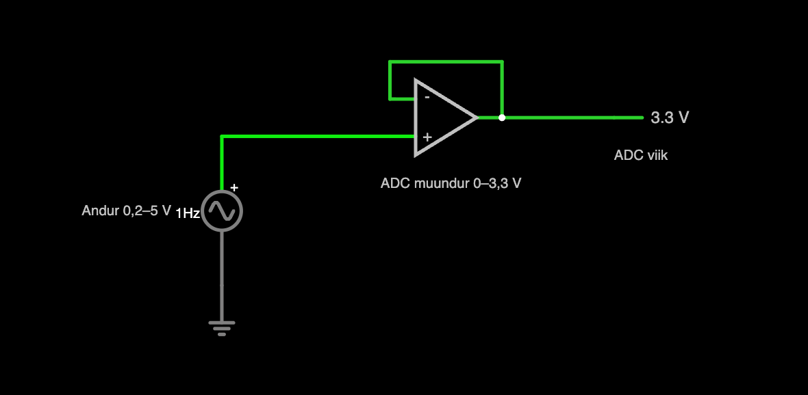
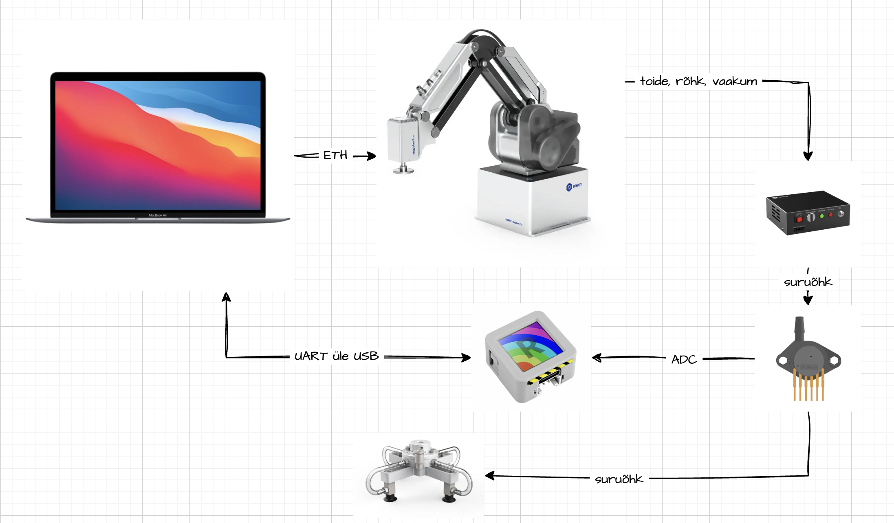

## Andmehõive: Labor 1 — Andur, ja kompressor, mis ise seisma jääb

**Töömaht:** 32 tundi | **Hindamine:** 20 punkti | **Meeskond:** 3 tudengit | **Välja antud:** 12.09.26 | **Tellimise kuupäev:** 22.09.26 | **Esimene kaitsmine:** 06.10.26, veebis

### Kuidas see dokument töötab

* Kopeeri see fail esimesel päeval oma repo laborikausta `README.md`-ks ja täida seal, töö käigus.
* KAARDISTA ise on puudu, sest vastust ei tea veel keegi. Sina ise mõõdad ja kirjutad numbri ja põhjuse siia.
* Midagi ei kustutata. Vale number jääb, kuupäevaga, parandus tuleb tema alla.
* Kirjuta nii, et meeskonnakaaslane, kes sel päeval ruumis ei olnud, saab aru: päris failinimed, päris numbrid, ühikud.
* Skeemid ja simulatsioonid lähevad dokumenti pildina, pildi juurde link elavale failile, et teine saaks selle lahti teha ja edasi muuta. Näited: osas 2 Falstadi simulatsioon, osas 3 draw.io skeem. Tee enda omad samade tööriistadega.
* Tähtaeg ei ole tähtis. Tähtis on, et asi saab tehtud ja sa saad aru. Ei tulnud esimesel korral välja, tule homme tagasi ja proovi uuesti. Kaitsta saab nii mitu korda, kui vaja.

### Eesmärk

Laboris on viis MG400 ja viis pumbakasti. Üks neist on tark: mõõdab rõhku ja laseb pumbal seista, kui rõhk on käes. Neli ülejäänut töötavad nii kaua, kui DO liin on üleval, ükskõik, mis torus toimub. Kõik viis peavad käituma nagu tark. Selleks läheb igasse väljundtorusse oma andur, AtomS3 ekraanile rõhk ja otsus, ja arvutisse Python, mis loeb Atomit UART-USB kaudu ja lülitab pumba MG400 DO liini kaudu. Aasta lõpuks on see loogika tööriista trükkplaadil. Praegu on ta maketeerimisplaadil, kus viga maksab ühe juhtme. Sama meeskond teeb kõiki kolme ainet: sama Atom saadab ka tähe, mille robot joonistab. Kolm ainet, üks demo: **vajuta tähte, robot joonistab selle.**

Selles laboris on kolm asja:

1. **Andur.** Pumbakast teeb −70 … +110 kPa. Vali andur, mis näeb mõlemat märki, ja ütle numbritega, miks just see. Esimesel päeval on MPX5700AP vanade asjade kastist.
2. **Tark kast.** Logi tehase tark kast enne, kui ise midagi disainid. Kaks lülituspunkti ja tsükli aeg.
3. **Sinu kast.** Atom otsustab, ekraan näitab, arvuti lülitab. Pump jääb ise seisma imemisel ja puhumisel, ja robot võtab sellega klaasi.

Esimene asi on tellimus. Esimesel päeval uusi osi ei ole: mõtle välja, mida see labor üldse vajab ja mis riiulil puudu on, ja kirjuta see tellimuseks, mis läheb välja 22.09. Tellitu jõuab kohale selle labori ajal. Seni ehita sellest, mis riiulil on.

*See on elav dokument. Uuenda eesmärke, kui need töö käigus muutuvad — uued teadmised teevad vanad eesmärgid vahel mõttetuks. Mõte on hoida meeskond kogu aeg sihil, et ei eksitaks detailide metsa ja põhiprobleem ei jääks lahendamata.*

**KAARDISTA ISE — eesmärk nii, nagu ta tegelikult välja tuli.**

### Kontrollnimekiri

**Peab olema tehtud**

- [ ] Tellimus 22.09: mis selle labori jaoks riiulil puudu on, anduri valik numbritega.
- [ ] MPX5700AP maketeerimisplaadil, Atom näitab kPa, logija kirjutab CSV 100 Hz.
- [ ] Targa kasti logi olemas, kaks lülituspunkti teada.
- [ ] Sinu kast jääb ise seisma imemisel ja puhumisel. USB välja, pump välja.
- [ ] Täht: nupp valib tähe, Atom saadab selle jaama.
- [ ] Repo ja arenduspäevik täidetud, tag `data-acquisition-lab1`.

**KAARDISTA ISE — kuupäevad ja sinu enda sammud.**

### Sisendid

* Riiulilt: AtomS3, MPX5700AP, maketeerimisplaat, passiivkomplekt, multimeeter, ostsilloskoop, 4 mm voolik, T-liitmik, vooliku kork, iminapp, polükarbonaatklaas.
* Õppejõult: MG400 koos oma pumbakastiga, tehase tark kast kordamööda, MG400 baaspakett Pythonis, kus on DO sisse ja välja: [KKallas/mg400-base](https://github.com/KKallas/mg400-base).
* Nutikad Lahendused L1: kanal tähe jaoks, lepitakse kokku esimesel nädalal.

### Vahendid

1. AtomS3 ×2, USB-C kaablid
2. MPX5700AP; sinu valitud andur, kui tellimus kohale jõuab
3. Maketeerimisplaat, juhtmed, takistite ja kondensaatorite komplekt, multimeeter
4. Ostsilloskoop FFT funktsiooniga
5. 4 mm voolik, T-liitmik, vooliku kork, iminapp φ13 või φ16, 24 × 24 mm klaas
6. MG400 koos pumbakasti ja baaspaketiga
7. Arduino IDE või PlatformIO ESP32 jaoks; Python 3, pyserial, Jupyter Lab, numpy, pandas, scipy, matplotlib
8. Falstad skeemisimulaator, draw.io skeemide jaoks
9. Git, üks repo meeskonna kohta, `AGENTS.md` juurkaustas

*Kui plaan muutub, uuenda ka vahendeid, või tee draw.io skeem, mis näitab, kuidas asjad omavahel töötavad.*

**KAARDISTA ISE — mida sa päriselt kasutasid.**

### Taustainfo

* **AtomS3**: viigud, ADC viigud, ekraan, nupp
  [https://docs.m5stack.com/en/core/AtomS3](https://docs.m5stack.com/en/core/AtomS3)
* **ESP32 ADC ja UART Arduinos**
  [https://randomnerdtutorials.com/esp32-adc-analog-read-arduino-ide/](https://randomnerdtutorials.com/esp32-adc-analog-read-arduino-ide/)
  [https://randomnerdtutorials.com/esp32-uart-communication-serial-arduino/](https://randomnerdtutorials.com/esp32-uart-communication-serial-arduino/)
* **pyserial**, arvuti pool
  [https://pyserial.readthedocs.io/](https://pyserial.readthedocs.io/)
* **Andurid**
  MPX5700AP: [https://www.nxp.com/docs/en/data-sheet/MPX5700.pdf](https://www.nxp.com/docs/en/data-sheet/MPX5700.pdf)
  MPX5100DP: [https://www.nxp.com/docs/en/data-sheet/MPX5100.pdf](https://www.nxp.com/docs/en/data-sheet/MPX5100.pdf)
  NXP MPX pere tähed: AP absoluutne, GP manomeetriline, DP diferentsiaalne, V vaakum. Absoluutandur näeb mõlemat märki, manomeetriline ainult ühte.
* **Pumbakast**: otsi fraasi "Dobot MG400 vacuum pump box IO control". Kaks DO liini; klemmid juhendist.
* **Kuidas rõhulüliti kompressoril töötab**: otsi fraasi "compressor pressure switch cut-in cut-out hysteresis short cycling".
* **Falstad**: [https://www.falstad.com/circuit/circuitjs.html](https://www.falstad.com/circuit/circuitjs.html)
* **Fourier**: [https://docs.scipy.org/doc/scipy/reference/fft.html](https://docs.scipy.org/doc/scipy/reference/fft.html) ja `scipy.signal.welch`

*Lisa siia oma allikaid ja kasulikku infot, mis aitaks sul projektist aru saada ka aastaid hiljem, kui selle uuesti lahti teed.*

**KAARDISTA ISE — sinu allikad.**

### Osad

#### 1. Mida tellida

See tuleb enne ehitamist. Käi labor paberil läbi ja mõtle välja, mida üldse tellida vaja on. Iga osa kohta: mis asju see küsib, mis on riiulil, mis on puudu. Puuduv läheb tellimusse.

Suurim küsimus on andur. Kandidaadid: üks absoluutandur, mille skaala katab 30–210 kPa; kaks manomeetrilist andurit, üks plussile ja üks vaakumile; või jääbki MPX5700AP. Iga kandidaadi kohta andmelehelt samad numbrid: tundlikkus mV/kPa, Pa ühe ADC sammu kohta, skaala kasutus protsentides, väljund 3,3 V vastu. Null-tulemus on ka tulemus: kui MPX5700AP on selle töö jaoks piisav, kirjuta see numbritega.

Kui osas 2 on müra mõõdetud ja osas 4 riba teada, lisa tabelisse riba jagatud müraga. Riba peab olema müra kohal kordades, mitte protsentides. Kui valik selle peale muutub, kirjuta see kuupäevaga vana otsuse alla.

Kirjuta üles: tabel ja otsus faili `docs/sensor_choice.md`; tellimus Mouseri tootekoodidena faili `docs/bom.md` 22.09-ks, iga rea juures üks lause, milline osa või number seda küsib.

#### 2. Andur ja esimene signaal

MPX5700AP maketeerimisplaadil: 5 V, GND, Vout → ADC viik. Andur otse ADC-sse, vahel ei ole midagi: ei jagurit, ei op-ampi, ei filtrit. See on meelega. Labor 2 paneb vahele kõigepealt jaguri, siis op-ampi, ja võrdleb nelja spektrit. Võrdlus on olemas ainult siis, kui toores signaal on siin mõõdetud ja alles. Multimeeter enne, kui Atom külge läheb: toide 5 V, Vout atmosfääril umbes 0,85 V. Atomil iga 10 ms: loe ADC → kPa → ekraan → üks rida UART-i. Arvutis Python, mis kirjutab CSV veergudega `t_ms, adc, p_kpa, pump`. Kontroll: 10 s logi on 1000 ± 5 rida, ja ADC on multimeetriga 2 % piires nõus.

MPX5700AP on vale skaalaga, aga absoluutne, ja atmosfäär on tema skaala sees: −70 kPa on 31 kPa absoluutset, +110 kPa on 211 kPa, väljund 0,40–1,56 V. Kogu pumba ulatus on 26 % tema skaalast, umbes 125 Pa ühe ADC sammu kohta. Ülekandefunktsioon: `Vout = 5 · (0.0012858 · P + 0.04)`, P kPa absoluutne.

Kirjuta üles: Pa ühe ADC sammu kohta, müra LSB-des pump väljas ja pump sees, spektri tipud nimedega (pumba mootor, MG400 servod, USB toide, 50 Hz), vähemalt kaks neist kontrollitud allika väljalülitamisega. Falstadi skeem andur → ADC koos müraallikaga, simuleeritud müra mõõdetu vastu.

Falstadi algus: andur on vahelduvpingeallikas 0,2–5 V, ADC sisend on modelleeritud järgurina, mis lõikab 0 ja 3,3 V vahele. See on ADC mudel, mitte signaaliaste. Skoop ADC viigul näitab, kus signaal ära lõigatakse. Lisa sellele oma müraallikas. [Ava simulatsioon](https://www.falstad.com/circuit/circuitjs.html?ctz=DwYwlgTgBAZgvAIgAwKgFwM6KQOiUgRlTBEQNwCZ8KB2GgZiQA4KA2ATnZtRACNEArCigAHfgiGoAbhEGoAtpkEBTALQEiAPgBQUKMClQAHmVZIojACxQCZmzVap4yVAHdnRWLISf5AQyMpRAocS1ReMD8sBBDHAHodPWAAc2NTcysbO3p6R1hsBATdfVc0nzsCBwska0q85xQipL8yzNtzS3ws4WcmBT9Eehx6BTACqGSBn3wZwsSS1pqbS2s2ggonAqaFkwQ1iihO8w0N-Jdt4FLdo5t1w672zfP5y7Kb9sP2Vm6nxpeAeTeX26UAEKx+Z08GFIz2KwCMb3MFHBGm+yO4Z2EGDGPlOaGUiAAggA7AAmAFdoEgADQUQDIBAIoAA1OZwhG7CjAihUQ62KDckaY1DYsh4gkIQkAEQAwlB5OTyWTKVAkHT6NT6MzWUl2YhLMCCMCwQdDexfsKcetUPiiTKoFIwGAANba-QAeygymJiD6UAwIlMTyMpwDLnmSRE9vG0Lk2wjnvGQRcfphAldwDibp0GfAEB0QA)



#### 3. Tark kast

T-liitmik tehase targa kasti väljundtorusse, napp otsas, napp klaasi peal. Pump imemisele baaspaketi CLI-st. Logi viis minutit.

Kirjuta üles: väljalülitusrõhk, sisselülitusrõhk, pumba tööaeg, seisuaeg, käivitusi minutis. Need viis numbrit on sinu kasti sihtmärk.

Kuidas asjad omavahel töötavad: arvuti, robot, pumbakast, andur, Atom ja haarats. [Ava draw.io skeem](https://drive.google.com/file/d/1YczRgRYat7b16Y7tdC8Wtg52FTfknlgd/view?usp=sharing)



#### 4. Sinu kast

Sama T sinu meeskonna tavalise kasti torusse. Atom saab arvutist režiimi ja riba, otsustab ise ja näitab ekraanil rõhu, režiimi ja otsuse. Arvuti kirjutab iga rea CSV-sse ja tõmbab DO liini otsuse järgi. Kui 500 ms jooksul rida ei tule, DO maha. Ohutu olek on lihtne: kui midagi on valesti, pump seisab.

```
Atom → arvuti:  {"t":123456,"adc":2011,"p":-52.3,"mode":"suction","pump":1}
arvuti → Atom:  {"cmd":"mode","mode":"suction"}   {"cmd":"band","on":-40,"off":-60}   {"cmd":"stop"}
```
```
iga 10 ms: loe ADC → kPa → ekraan → rida UART-i
imemine:  kui p on sisselülitusrõhust nõrgem ja seisuaeg ≥ alampiir → pump 1
          kui p on väljalülitusrõhust tugevam → pump 0
puhumine: sama, teise märgiga
off, lugem skaalast väljas, käivitusi minutis üle piiri → pump 0, ekraanil põhjus
```

Hoidmine: pump välja väljalülitusrõhul, logi langemist kuni sisselülitusrõhuni. Kolm olukorda: napp klaasil, napp õhus, voolik korgiga. Sealt tuleb riba laius, seisuaja alampiir ja käivituste ülempiir. Napp õhus ei tohi lühitsüklitesse minna: kast, mis iga sekund käivitub, ei ole tark, ta on katki.

Võtmine: robot viib napi klaasile, imemine, tõst, koht, puhumine, lahti. Kümme korda.

Kirjuta üles: riba, seisuaja alampiir, käivitusi minutis kolmes olukorras, rõhk napp klaasil ja napp õhus, pumba töötsükkel kümne võtmise ajal. Kõik koos loogikaga faili `docs/pump_control.md`. Jaam võtab need üle nii, nagu nad on.

#### 5. Täht

Lühike vajutus käib tähestikku läbi, pikk vajutus saadab `{"letter":"A"}` Nutikate Lahendustega kokkulepitud kanalisse. Jaam loeb, robot joonistab.

**KAARDISTA ISE — vastused.** Iga osa kohta: numbrid, ühikud, kus fail on. Tegemata asja kohta üks rida, miks.

### Ohutus

* USB ja 5 V välja, enne kui juhet liigutad. Viigud andmelehelt. ADC viik ei kannata 5 V; andur, mille väljund käib 4,7 V-ni, ei lähe täisskaalal otse viiku.
* Pumbakast on 24 V. DO liinid ühendatakse siis, kui robot on keelatud ja kast vooluvõrgust väljas.
* Pumba mootor ei ole tehtud iga sekund käivituma. Seisuaja alampiir enne, kui riba kitsaks lähed. Kui kast on soojem kui käsi, riba laiemaks.
* Lahtine voolik +110 kPa juures lendab; ära suuna kellegi poole. Napp −70 kPa juures ei lähe nahale.
* Robot: käed ei ole laual, kui robot on sisse lülitatud. Esimene jooks aeglaselt, hädastopp käeulatuses.
* Selles laboris ei joodeta.

### Komponendid selle labori jaoks

Tellimus läheb välja 22.09.26 ja jõuab kohale enne kaitsmist. Valmis nimekirja ei ole: meeskond paneb tellimuse ise kokku osa 1 põhjal. Mõtle näiteks, kas MPX5700AP jääb või tuleb uus andur ja kas ka varuks, ja kas voolikuliitmikke ja korke jätkub.

### Hindamiskriteeriumid

| Kategooria | Punktid |
| :--- | :--- |
| Tööfailid — Atomi püsivara, Pythoni logija ja pumba juhtimine, CSV failid | 5 p |
| Analüüs — Pa ühe ADC sammu kohta, spektrid nimedega, targa kasti numbrid, hoidmiskõverad, anduri valik | 5 p |
| Prototüüp — sinu kast jääb ise seisma imemisel ja puhumisel, USB välja = pump välja, robot võtab klaasi, täht jõuab jaama | 5 p |
| Dokumentatsioon — README, arenduspäevik, `pump_control.md`, `sensor_choice.md`, `bom.md`, AGENTS.md | 5 p |
| **Kokku** | **20 p** |

### Kaitsmine

Link git repole, tag `data-acquisition-lab1`.

Kaitsmine on lihtne suuline 15 minuti jutuajamine. Näitad, kuidas sinu kast ise seisma jääb ja uuesti käivitub, kui nappi kergitad, ja avad oma arenduspäeviku. Õppejõud küsib umbes viis küsimust selle kohta, kuidas sa selle tegid. Kui esimesel korral ei õnnestu, tuled uuesti.

Repos on kaustas `data-acquisition/lab1/`: `src/` püsivara ja logijaga, `data/` CSV failidega, `notebooks/` spektritega, `docs/` skeemi foto, ostsilloskoobi pildi, Falstadi ekspordi ja kolme md-failiga, see fail kui `README.md`, ja `AGENTS.md` uuendatud.

### Arenduspäevik

**KAARDISTA ISE — päevik.** Üks sissekanne iga töösessiooni kohta, kirjutatud iseendale, nii et inimene, kes seal ei olnud, saab aru. Sissekandeid lisatakse, mitte ei muudeta.

**PP.KK.AA — kes olid kohal**
* Tegime:
* Juhtus (numbrid):
* Otsustasime, ja miks:
* Lahti järgmiseks korraks:

### Väljundid ja tulemused

**Väljundid**
* Nutikad Lahendused L1: täht jaama; pumba juhtimise loogika ja lülituspunktid failis `docs/pump_control.md`.
* Andmehõive L2: maketeerimisplaat, 100 Hz logija, CSV formaat, esimesed spektrid toore signaaliga, mille vastu jagur ja op-amp võrreldakse.
* Andmehõive L3: sama loogika, mis kolib tööriistaplaadile.

**KAARDISTA ISE, lõpus.**
* Git repo ja tag:
* Numbrid, mille see labor andis, ühikutega:
* Mida me teeksime teisiti:
* Mida järgmine labor peaks enne alustamist teadma:

### Tagasiside
