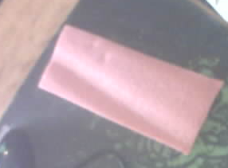
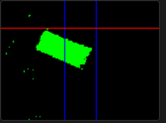

# RAR-Tartu-Protyypimine

{:height="35%" width="35%"}

## Projekti kirjeldus

See projekt käsitleb väikese roomikutega roboti prototüübi ehitamist ja juhtimist. Robot kasutab ESP32-põhist juhtmoodulit, eraldi M12 kaameramoodulit, kaugusandurit ja kahe DC reduktormootoriga roomikveermikku.

Roboti eesmärk on tuvastada kaamerapildist objekt/blob, lugeda kaugusanduri näitu ning juhtida mootoreid kas käsitsi, automaatse demo-loogika või välise agendi kaudu.

## Key features

- **Autonoomne töö** – kogu roboti loogika töötab roboti enda ESP-põhistes mikrokontrollerites. Välist arvutit, serverit ega eraldi pilditöötlust ei ole roboti tööks vaja.
- **Pikk tööaeg akutoitel** – robot kasutab 2 × 18650 Li-ion akut rööbiti. Kasutada saab kuni umbes 3600 mAh elemente, mis annab väikesele robotile suhteliselt suure akumahu. Vajadusel töötab robot ka ühe 18650 akuga.
- **USB-C ja micro-USB laadimisvõimalus** – akuhoidiku/toitemooduli kaudu saab akusid laadida nii USB-C kui ka micro-USB sisendi kaudu.
- **Aku SOC indikaator** – akuhoidikul on laetuse indikaator, millega saab kiiresti hinnata aku ligikaudset laetust ilma eraldi mõõteseadmeta.
- **Kaamerapõhine objekti/blob’i tuvastus** – M12 kaameramoodul tuvastab värvipõhist objekti/blob’i ning edastab selle asukoha UART-i kaudu roboti põhikontrollerile.
- **Kaugusandur eesmisel suunal** – VL53L1X Time-of-Flight andur võimaldab mõõta roboti ees oleva objekti või takistuse kaugust.
- **Roomikveermik** – SMARS-stiilis roomikutega kere annab robotile lihtsa ja kompaktse mehaanilise platvormi, mis sobib prototüüpimiseks ja erinevate juhtimisloogikate testimiseks.
- **Veebipõhine kasutajaliides** – roboti olekut, juhtimisrežiime ja sensorinäite saab jälgida veebiliidese kaudu.
- **Mugav tuning/runtime vahetus** – kasutajaliides võimaldab liikuda seadistamise/tuning režiimi ja runtime režiimi vahel ilma Arduino IDE, Serial Monitori või terminali kasutamata.
- **Kolm juhtimisrežiimi** – robot toetab käsijuhtimist, automaatset demo-režiimi ja AI/API kaudu juhitavat agent-režiimi.
- **Manual mode** – robotit saab veebiliidesest otse juhtida, mis lihtsustab mootorite, roomikute ja liikumissuundade testimist.
- **Automatic demo mode** – robot kasutab kaamera blob’i asukohta ja kaugusanduri näitu, et demonstreerida iseseisvat objekti poole liikumist.
- **AI/API mode** – roboti sensorinäidud ja juhtkäsklused on kättesaadavad välisele agendile API kaudu, mis võimaldab hiljem katsetada kõrgema taseme otsustusloogikat.
- **3D-prinditav ja muudetav mehaanika** – kere, rattad, roomikud ja kaamerahoidja on 3D-prinditavad ning Fusioni mudelid on eraldi failidena olemas, et neid saaks edasi muuta.
- **Eraldi dokumenteeritud ühendused ja kokkupanek** – pinout, BOM ja kokkupaneku juhend on hoitud README-st eraldi, et põhifail jääks ülevaatlik ja detailid oleksid lihtsasti leitavad.

## Eesmärgid

1. Võtta kaameramoodulilt UART-i kaudu vastu tuvastatud objekti/blob’i andmed.
2. Juhtida kahte DC reduktormootorit DFRobot DRI0044 TB6612 mootorikontrolleri kaudu.
3. Kuvada veebiliideses roboti olek, kaugusanduri näit ja juhtimisrežiimid.
4. Võimaldada kolme juhtimisrežiimi: käsijuhtimine, automaatne demo ja agent-režiim.
5. Luua REST API / MQTT kaudu liides, mille kaudu väline AI-agent saab lugeda sensoriandmeid ja anda mootorikäsklusi.

## Lahenduse ülevaade

Projektis kasutatakse:

- ESP32-PICO / M5Stack Atom Matrix tüüpi juhtmoodulit roboti põhiloogika jaoks;
- M5Stack AtomS3R M12 kaameramoodulit objekti/blob’i tuvastamiseks;
- DFRobot DRI0044 TB6612 mootorikontrollerit kahe DC mootori juhtimiseks;
- kahte 6 V DC reduktormootorit roomikveermiku liigutamiseks;
- Pimoroni VL53L1X Time-of-Flight kaugusandurit eesmise kauguse mõõtmiseks;
- 18650 akudel põhinevat toitelahendust;
- 3D-prinditud SMARS-stiilis kere, rattaid, roomikuid ja kaamerahoidjat.

Kaameramooduli pildikvaliteedi ja blob detectioni näide:

<table>
  <tr>
    <td></td>
    <td></td>
  </tr>
</table>

## Dokumentatsioon ja failid

| Asukoht | Kirjeldus |
|---|---|
| [`docs/pinout.md`](docs/pinout.md) | Roboti lõplik pinout ja ühenduste kirjeldus. |
| [`docs/assembly_guide_and_BOM.md`](docs/assembly_guide_and_BOM.md) | Roboti kokkupaneku juhend koos BOM-i, 3D-printimise info ja komponentide ühendamise järjekorraga. |
| [`3d_models/`](3d_models/) | Fusioni muudetavad CAD-failid ja STL-failid 3D-printimiseks. |
| [`media/`](media/) | README ja dokumentatsiooni jaoks kasutatavad pildid. |

## Juhtimisrežiimid

### 1. Käsijuhtimine

Veebiliideses saab robotit juhtida noolenuppudega. Seda kasutatakse mootorite, suuna, roomikute liikumise ja üldise mehaanika testimiseks.

### 2. Automaatne demo

Robot loeb kaameramoodulilt blob’i asukohta ning proovib selle põhjal liikuda tuvastatud objekti suunas. VL53L1X kaugusandurit kasutatakse takistuse või sihtobjekti kauguse hindamiseks.

### 3. Agent-režiim

Robot teeb kaamera ja kaugusanduri andmed kättesaadavaks välisele süsteemile REST API / MQTT liidese kaudu. Väline agent saab nende andmete põhjal otsustada, millised mootorikäsklused robotile saata.

## Tarkvara ülesehitus

Põhijuhtmooduli tarkvara ülesanded:

- WiFi ühenduse loomine ja IP-aadressi väljastamine Serial Monitorisse;
- veebiliidese pakkumine käsijuhtimiseks ja oleku jälgimiseks;
- mootorite juhtimine PWM ja DIR signaalidega;
- UART sõnumite lugemine kaameramoodulilt;
- VL53L1X kaugusanduri lugemine I2C kaudu;
- roboti oleku kuvamine veebiliideses;
- REST API / MQTT liidese pakkumine välisele juhtloogikale.

## Meeskond

- Margo
- Martin
- Rein
